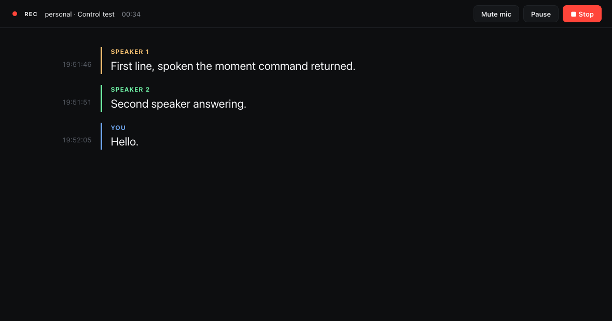
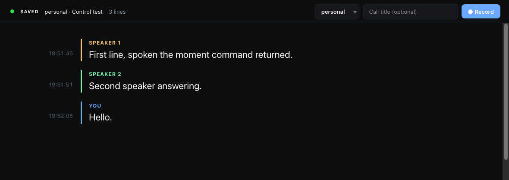

# hark-viewer

A live transcript page and recording controls for [hark](https://github.com/PhantomYdn/hark), the macOS CLI that captures system audio and the microphone and transcribes them on-device.

hark writes a call's transcript to a file while people are still speaking. hark-viewer shows that file in the browser as it grows, with a colour per speaker and a clock time per line, and puts Record, Stop, Pause and Mute on the same page. It also ships an [agent skill](SKILL.md), so a coding agent such as Claude Code can start a recording and answer questions about the call while it is happening.



## What it does

- Records the whole computer plus your microphone through hark's Core Audio tap. No per-app tracking, no virtual audio driver.
- Keeps your microphone on the left channel and the call on the right, so a later pass can still tell them apart.
- Shows each utterance a moment after the speaker pauses, labelled `You` for the microphone and `Speaker 1..N` for voices on the computer side.
- Shows the line still being spoken in grey under the finished ones, when hark reports one. The start request asks for it (`liveStreaming` in `START`), so a hark that can stream does, and one that cannot ignores the key. Text then lands about 2.5 seconds behind the audio and the open line grows in place until it closes. It is never corrected as it grows. With the setting off the page behaves as before.
- Starts, stops, pauses and mutes from the page. No terminal window stays open.
- Says so when the capture dies. hark can lose the call side and go on reporting `recording`; the page shows a red banner when hark proves it, and an amber note when it can only guess.
- Restarts a broken capture into the same call folder, so one call stays one folder on one clock.
- Files every call in its own folder, keeps the audio, and writes the accurate transcript on its own once the call stops.
- Runs on `127.0.0.1` only. Nothing leaves the machine.

## Requirements

- macOS 14.4 or later on Apple Silicon
- [hark](https://github.com/PhantomYdn/hark) 0.4.3 or later, with the Parakeet model:

  ```sh
  brew tap PhantomYdn/hark https://github.com/PhantomYdn/hark
  brew install phantomydn/hark/hark
  hark models download parakeet:v3 --default
  hark models download fluidaudio:diarizer
  ```

- Python 3. The one macOS ships is enough, and there are no packages to install.

## Use

```sh
git clone https://github.com/GeiserX/hark-viewer.git
cd hark-viewer

./hark-viewer work "Weekly sync"   # record a call filed under "work" and open the page
./hark-viewer open                 # open the page without recording
./hark-viewer stop                 # stop and save the call
./hark-viewer restart              # capture broke mid-call: stop, and record on into the same folder
./hark-viewer quit                 # stop the call, the page server and the hark agent
./hark-viewer relabel              # fix the speaker labels of the call just finished
./hark-viewer finalize             # write the accurate transcript by hand (a stopped call gets it on its own)
```

The first recording asks for the Microphone and System Audio Recording permissions. macOS attributes them to the terminal app you ran the command from.

You can also start from the page. Pick a folder, type a title and press **Record**.



## Where calls go

```
~/Recordings/calls/<workspace>/<YYYY-MM-DD_HHMMSS>[_title]/
    audio.opus         the recording, microphone left, call right
    transcript.json    one JSON object per line: {"start", "end", "speaker", "text"}
    meta.json          {"started", "workspace", "title"}, plus "parts" once the call was restarted
    transcript.final.json   the accurate transcript, written after the call stops
    transcript.mw.txt       MacWhisper's transcript of the same audio, when MacWhisper is installed
    postprocess.json        how far those two have got
~/Recordings/calls/current  ->  the call being recorded, or the last one
```

`transcript.json` is JSON Lines. hark appends a complete line per utterance, so any program can read the file during the call. `start` and `end` are seconds into the recording; add `start` to `started` in `meta.json` to get the clock time.

The audio is Opus because an Opus file stays playable while hark is still writing it, so a crash mid-call costs nothing. `.m4a` and `.flac` hold back their header until hark stops, and `.wav` would cost 635 MB an hour against Opus's 23. macOS types the file as `org.xiph.ogg-audio`, so transcription apps open it like any other recording.

## When the capture dies mid-call

hark's tap on the call side can go silent while hark still reports `recording`. On a 71-minute call it happened twice, and nothing on the page said so.

A hark that checks its own capture reports it in `/status` as `session.callAudio`, `{"state", "silentFor", "restarts"}`, and the page shows it under the header:

| `state` | Means | Page |
|---|---|---|
| `ok` | audio is arriving | nothing |
| `silent` | the call side is quiet, and hark checked that nothing is playing | grey note, `call side quiet for 00:42` |
| `dead` | audio is playing and the capture hears none of it; hark is restarting the capture | red banner |
| `recovered` | the capture is back | green note with the restart count |

A hark without `callAudio` leaves the page to guess. After 90 seconds of recording with no new line and no open line it shows an amber note, `no new lines for 01:35`. Amber because nobody talking before a meeting starts looks the same from the page as a dead capture. `?quiet=SECONDS` on the page URL changes the 90.

**Restart** on the page, or `./hark-viewer restart`, stops the recording and starts a new one into the same call folder. hark never overwrites a file, so the new part gets new names and `meta.json` lists them:

```
audio.opus        transcript.json          part 1, the names every call has
audio.part2.opus  transcript.part2.json    part 2, and so on

meta.json  "parts": [{"n": 1, "started": 1790000000.0, "audio": "audio.opus",       "transcript": "transcript.json"},
                     {"n": 2, "started": 1790001173.2, "audio": "audio.part2.opus", "transcript": "transcript.part2.json"}]
```

A call never restarted has no `parts` key and reads as it always did. The server answers `GET /<call>/transcript.json` for a restarted call with every part's lines joined, each part moved onto the call's clock by `part.started - meta.started`. The page reads that URL, so it shows one continuous transcript. A program reading the folder does the same sum, or asks the server. Restart also works after hark reports the session `failed`, and after the agent died, when it goes on in the call `current` points at. It refuses a call that already has its `postprocess.json`.

hark answers `stopped` the moment a stop is asked for. Its capture finishes writing the audio afterwards, `/status` does not show that, and until it is done `/start` answers 409 "still finishing". So a restart, and a new call, keep asking for up to 15 seconds (`HARK_VIEWER_STOP_WAIT`). hark itself gives up on a capture after 10 seconds and then refuses every start until its agent is restarted, so past the 15 the server kills the agent on hark's port, starts a new one and asks once more.

## The accurate transcript

The live transcript is the fast pass. When a call stops, whether from the page, `hark-viewer stop`, `hark-viewer quit` or hark itself, the server starts [`postprocess.py`](postprocess.py) as a detached process. It outlives the page and the server, runs at low priority, and never touches the audio or `transcript.json`. Because `stopped` comes before the audio is complete, the job first waits until no part's audio has changed for 5 seconds, for at most 120, and records that wait as `settled: {"waited", "capped"}`. `hark-viewer quit` waits the same way before it kills the agent. The job writes:

- `transcript.final.json`, from `hark -i <audio> --speakers --speaker-mode source --speaker-labels "Microphone,Others"` over each part, joined on the call's clock. JSON Lines with the keys of `transcript.json`. It needs a hark whose `--speaker-mode source` reads a file's two channels, see [below](#getting-your-own-voice-back-out).
- `transcript.mw.txt`, from MacWhisper's `mw transcribe <audio> --speakers`, tried twice, because it fails now and then with `GRDB.RecordError error 0` and works the next time. This one is there to compare the two transcribers and will go. `HARK_VIEWER_MW=off` turns it off, and without MacWhisper installed the step is skipped.
- `postprocess.json`, the state of the job, which `/api/status` also carries as `postprocess` for the last call. The page shows it as `final transcript: running`, `ready` or `failed`.

```json
{"state": "done", "pid": 48020, "started": 1790010463.1, "finished": 1790010632.7, "settled": {"waited": 5.2, "capped": false},
 "steps": {"final": {"state": "done", "started": 1790010463.1, "finished": 1790010495.4, "error": null, "skipped_spans": []},
           "mw":    {"state": "done", "started": 1790010495.4, "finished": 1790010632.7, "error": null, "skipped_spans": []}}}
```

`state` is `running`, `done` or `failed`, and follows the `final` step. A step is `pending`, `running`, `done`, `failed` or `skipped`. A job that died reads as `failed`, also when another process has taken its pid since. A job sent SIGTERM removes its scratch folder and records `failed`, and each job sweeps the scratch folders of jobs that were killed outright.

hark can refuse a whole recording. It did on a 51-minute file, with `Invalid audio data provided. Must be at least 300ms of 16kHz audio`. The job then cuts that part into 10-minute pieces with `ffmpeg`, halves any piece hark still refuses down to about 20 seconds, and skips only the piece that fails at that size. `skipped_spans` lists what it skipped as `{"start", "end", "part", "error"}` on the call's clock. When hark refuses every piece the step fails and writes no transcript.

`postprocess.json` is also the lock. The job links it into place already filled in, so it runs once per call and nobody ever reads the file empty. `./hark-viewer finalize [call] --force` runs it again, and without `--force` it does a call that never got one, such as a call recorded before this existed.

## How it fits together

```
browser page  ──►  server.py :8474  ──►  hark --remote-control :8473
     ▲                  │                          │
     └── transcript ────┴──── reads ◄── writes ────┘
                     ~/Recordings/calls/…
```

[`server.py`](server.py) is a single standard-library Python file, and the page is [`viewer.html`](viewer.html). The server serves the page and the call folders, and forwards the control requests to hark's [remote-control agent](https://github.com/PhantomYdn/hark/blob/main/docs/remote-control.md). The page cannot call the agent directly because the agent sends no CORS headers. The server starts the agent when it is not running.

### API

| Request | Does |
|---|---|
| `GET /api/status` | Agent state, the active session, the call it belongs to, its number of `parts`, the `postprocess` state of that call, and the workspace folders. The session goes through as hark sent it, so it carries `partial` while a streaming hark has a line open and `callAudio` on a hark that checks its capture, and neither key otherwise |
| `POST /api/new` with `{"workspace", "title"}` | Creates the call folder and starts recording |
| `POST /api/restart` | Stops the recording and starts the next part in the same call folder. Answers `{"call", "part"}`, or 409 when nothing is recording |
| `POST /api/stop`, `/pause`, `/resume`, `/mute`, `/unmute` | Forwarded to hark |
| `GET /<call>/transcript.json` | The live transcript. For a restarted call, every part joined on the call's clock |

Every `POST` needs the header `X-Hark-Viewer: 1`.

### Settings

| Variable | Default | |
|---|---|---|
| `HARK_VIEWER_ROOT` | `~/Recordings/calls` | Where calls are filed |
| `HARK_VIEWER_PORT` | `8474` | Port of the page |
| `HARK_REMOTE_CONTROL_PORT` | `8473` | Port of hark's agent |
| `HARK_VIEWER_BROWSER` | `Firefox` | App that opens the page; the system default is used when it is missing |
| `HARK_BIN` | `hark` | The hark binary to run. Point it at your own build to run an unreleased hark |
| `HARK_VIEWER_MW` | `/Applications/MacWhisper.app/Contents/MacOS/mw` | MacWhisper's command line, for `transcript.mw.txt`. `off` skips that step |

Set any of these in the environment, or in `~/.config/hark-viewer.env`, which the launcher reads if it exists.

The `START` dictionary at the top of [`server.py`](server.py) holds what hark records with. By default that is system audio with the microphone mixed in, speaker labels, and the Core Audio backend.

## As an agent skill

The repository root is a skill. [`SKILL.md`](SKILL.md) sits next to the [`hark-viewer`](hark-viewer) command it runs. For Claude Code:

```sh
git clone https://github.com/GeiserX/hark-viewer.git ~/.claude/skills/record-call
```

Then `/record-call` starts a recording. While the call runs, ask the agent what was just said or what was decided, and it reads `~/Recordings/calls/current/transcript.json` before answering.

### Fixing the speakers after the call

Live speaker numbers are guessed as the audio arrives, so a long call with several voices reuses one number for two people. A diarizer that gets the whole recording at once does better:

```sh
./hark-viewer relabel                                   # the call in `current`
./hark-viewer relabel work/2026-09-21_101500 --dry-run   # counts only, writes nothing
```

[`relabel_speakers.py`](relabel_speakers.py) splits the call side of `audio.opus`, runs it through hark, and writes two files next to the recording:

- `speakers.json`, the spans it found, so a second run needs no model
- `transcript.speakers.json`, the live lines with the speaker of the span each one overlaps most

It never touches `transcript.json`, and it leaves lines labelled `You` alone. [`server.py`](server.py) serves `transcript.speakers.json` in place of `transcript.json` when it exists, so the page and any agent reading the call get the better labels for free. A page already on screen keeps the rows it has drawn. Reload for the new colours. Run it once the call is over: a line hark appends after the relabel makes the live file the newer one, and the newer file is the one served.

On the eight-person call this was built against, the live pass used three speaker numbers and the offline pass found all seven. 59 of the 69 non-`You` lines matched a span and the other 10 kept their live label. The run took eleven seconds. `relabel` exits 3 and writes nothing when fewer than 60% of the lines match, which catches spans belonging to a different recording.

### Getting your own voice back out

The recording keeps the microphone on channel 0 and the call on channel 1, so a manual pass can still tell them apart:

```sh
ffmpeg -i audio.opus -af "pan=mono|c0=c1" call.wav   # just the call (c0=c0 for your microphone)
hark -i audio.opus --speakers --speaker-mode source -t final.json   # You / Others
```

**On hark 0.4.3, `hark -i audio.opus` transcribes your microphone and loses the call**, because it reads channel 0 of a stereo file and stops there. The result looks like a call nobody else spoke on. On one recording the stereo file gave 1544 characters of text, and the call channel alone gave 7891. Split the channel with `ffmpeg` first, which is what `relabel` does, or use a hark built from [the pull requests](https://github.com/PhantomYdn/hark/issues/6) that read both channels, named through `HARK_BIN`. `--speaker-mode source` on a file is unreleased for the same reason.

A hark built from those branches can stop the offline pass with `Must be at least 300ms of 16kHz audio`. The recording is fine; the branches drop a diarized span shorter than the recognizer accepts. 0.4.3 never hits it, and `relabel --spans FILE` takes spans from any build that works.

## Tests

```sh
python3 -m unittest discover tests
```

They need `ffmpeg` and no hark. A fake hark, a fake `mw` and a fake remote-control agent on spare ports stand in, so they never touch a live recording or ports 8473 and 8474.

## Limits

- Live speaker numbers are a guess made as the audio arrives, and two voices can share a number. `hark-viewer relabel` fixes them once the call is over. A line that spans two offline speakers gets the one it overlaps most, because splitting it would need word timings `transcript.json` does not carry.
- Speaker numbers start over in every part of a restarted call, so `Speaker 1` before a restart and after it can be two people. `relabel` covers part 1 only. `transcript.final.json` avoids both, because it only tells `Microphone` from `Others`.
- `hark-viewer quit` used to kill every `hark` process. It now kills only the remote-control agent, so an offline pass still running for the last call survives it.
- Relabelling is manual. Most of its ten seconds goes on the recognizer producing text the relabel then throws away, because hark has no way to diarize a file without transcribing it. A `hark speakers -i FILE` would make this near instant.
- A line appears when the speaker pauses for about 0.7 seconds, or after 12 seconds of unbroken speech. Those two values are fixed inside hark.
- hark records one microphone, the macOS default input.
- Clock times drift by the length of any pause, because hark leaves paused time out of the recording.
- Recording a call needs the consent of the people on it. The rules depend on where you and they are.

## License

[GPL-3.0](LICENSE)
