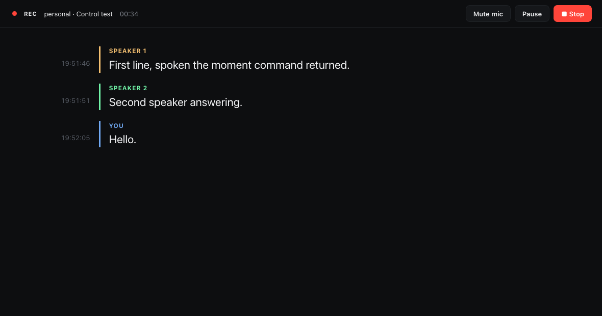

<p align="center">
  
</p>

# hark-viewer

<p align="center">
  <a href="https://github.com/GeiserX/hark-viewer/actions/workflows/ci.yml"></a>
  <a href="LICENSE"></a>
</p>

A live transcript page and recording controls for [hark](https://github.com/PhantomYdn/hark), the macOS CLI that captures system audio and the microphone and transcribes them on-device.

hark-viewer shows the transcript in the browser while hark writes it, with a colour per speaker and a clock time per line, and puts Record, Stop, Pause and Mute on the same page. It also ships an [agent skill](SKILL.md), so a coding agent such as Claude Code can start a recording and answer questions about the call while it is happening.



## Features

- Records the whole computer plus your microphone through hark's Core Audio tap, with no virtual audio driver.
- Keeps your microphone on the left channel and the call on the right.
- Labels lines `You` for the microphone and `Speaker 1..N` for voices on the computer side.
- Shows the line still being spoken in grey, when hark can stream it.
- Starts, stops, pauses and mutes from the page. No terminal window stays open.
- Warns when the capture dies, and restarts it into the same call folder.
- Files every call in its own folder, keeps the audio, and writes an accurate transcript once the call stops.
- Says which languages a call was in, and fixes live speaker labels after the call with `relabel`.
- Runs on `127.0.0.1` only. Nothing leaves the machine.

## Quick start

```sh
git clone https://github.com/GeiserX/hark-viewer.git
cd hark-viewer
./hark-viewer work "Weekly sync"   # record a call filed under "work" and open the page
```

Needs macOS 14.4 or later on Apple Silicon, [hark](https://github.com/PhantomYdn/hark) 0.4.3 or later with the Parakeet model, and the Python 3 macOS ships. Setup is in [Installation](docs/installation.md).

## Documentation

- [Installation](docs/installation.md): requirements and the hark models
- [Usage](docs/usage.md): every command, URL options, where calls are filed
- [When the capture dies mid-call](docs/capture-failures.md): the warnings, Restart, and the timeouts behind them
- [The accurate transcript](docs/accurate-transcript.md): the offline pass after a call, and language detection
- [How it fits together](docs/architecture.md): the server, its API and every setting
- [As an agent skill](docs/agent-skill.md): Claude Code, fixing speakers, getting your own voice back out
- [Development](docs/development.md): running the tests
- [Limits](docs/limits.md): what it cannot do yet. Recording a call needs the consent of the people on it.

## License

[GPL-3.0](LICENSE)
