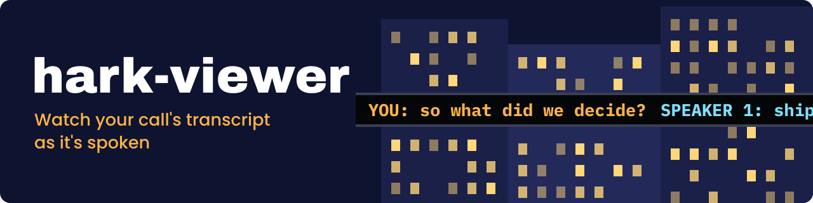
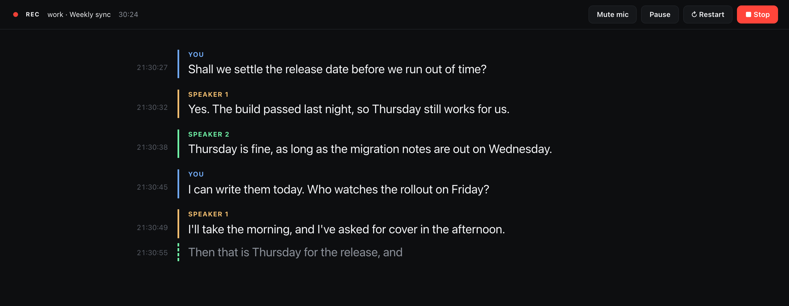
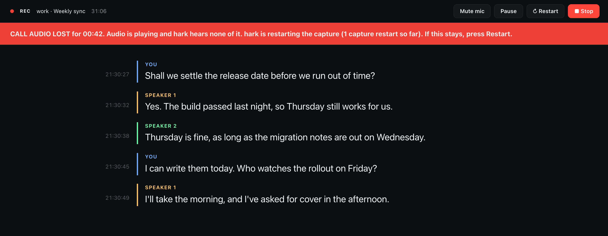
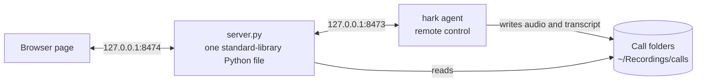

---
hide:
  - navigation
---

# hark-viewer { .hv-visually-hidden }

  

  
  
  

---

**hark-viewer** shows a call's transcript in the browser while [hark](https://github.com/PhantomYdn/hark), the macOS command line that records system audio and the microphone and transcribes them on-device, is still writing it. Without it you read a growing JSON file, and a capture that lost the call side looks like a quiet call, because hark can go on reporting `recording`. hark-viewer gives every speaker a colour and every line a clock time, puts Record, Stop, Pause and Mute on the same page, says so when the capture dies, and records on into the same call folder. Start with [Getting started](getting-started.md), then [Usage](usage.md).

-   :material-download: **[Getting started](getting-started.md)**

    ---

    macOS 14.4 or later on Apple Silicon, hark 0.4.3 with the Parakeet model, and a clone. Nothing to build or install.

-   :material-record-rec: **[Your first recording](getting-started.md#first-recording)**

    ---

    One command, the two macOS permissions it asks for, and what the page shows once it records.

-   :material-console: **[Usage](usage.md)**

    ---

    Every command, the three URL options of the page, and the folder each call is filed in.

-   :material-format-list-bulleted: **[Configuration](configuration.md)**

    ---

    Every setting with its default, from the port to the timeouts.

## The page

{ .hv-shot }

A line appears a moment after its speaker pauses, labelled `You` for your microphone and `Speaker 1..N` for voices on the computer side. When hark can stream, the line still being spoken shows in grey under the finished ones.

{ .hv-shot }

When the capture dies the page says so, in red when hark proves it and in amber when it can only guess, and **Restart** records on into the same call folder, so one call stays one folder on one clock ([Troubleshooting](troubleshooting.md#when-the-capture-dies-mid-call)).

{ .hv-shot }

## Ask an agent during the call

The repository is also an agent skill. Clone it into `~/.claude/skills/record-call` and `/record-call` in Claude Code starts a recording. While the call runs, ask the agent what was just said or what was decided, and it reads the live transcript before it answers. See [As an agent skill](agent-skill.md).

## After the call

- The [accurate transcript](accurate-transcript.md) is written on its own once the call stops, from the whole recording, into `transcript.final.json`. Its call side needs a hark newer than 0.4.3; on 0.4.3 it hears the microphone alone and says so ([why](agent-skill.md#getting-your-own-voice-back-out)).
- `./hark-viewer relabel` [fixes the live speaker numbers](agent-skill.md#fixing-the-speakers-after-the-call) with a diarizer that hears the whole call at once.
- `./hark-viewer languages` [says which languages the call was in](accurate-transcript.md#which-languages-the-call-was-in), using Apple's on-device language recognizer.

## How it runs

- The server serves the page and the call folders, and passes Record, Stop, Pause and Mute on to hark's agent, which it starts when it is not running. [How it works](how-it-works.md) has the [API](how-it-works.md#api).
- Every call gets its own folder with its audio, its live transcript and its metadata. [Where calls go](usage.md#where-calls-go) lists the files.
- Python 3 as macOS ships it, with no packages to install, and a zsh launcher. Nothing to build.

## What it does not do

- It runs on macOS 14.4 or later on Apple Silicon only, because hark's Homebrew binary and the Parakeet model are Apple Silicon only.
- It records one microphone, the macOS default input.
- Live speaker numbers are a guess, and they start over in every part of a restarted call. `relabel` fixes part 1 after the call.
- The full list, with the reasons, is on [Limits](limits.md).

## Privacy

- The page server listens on `127.0.0.1` only, refuses any other `Host` name, and needs the header `X-Hark-Viewer: 1` on every request that changes something.
- hark transcribes on the Mac, and the audio and transcripts stay in `~/Recordings/calls`. Nothing leaves the machine.
- Recording a call needs the consent of the people on it. The rules depend on where you and they are.

## Getting help

- The capture died or the page shows a warning: [Troubleshooting](troubleshooting.md). To report a bug, [what to include](troubleshooting.md#reporting-a-bug).
- A security problem: the [security policy](https://github.com/GeiserX/hark-viewer/blob/main/SECURITY.md), never a public issue.
- Running the tests and sending a fix: [Development](development.md).

## License

hark-viewer is released under the [GPL-3.0-or-later](https://github.com/GeiserX/hark-viewer/blob/main/LICENSE) license. It drives [hark](https://github.com/PhantomYdn/hark), which is a separate project.
