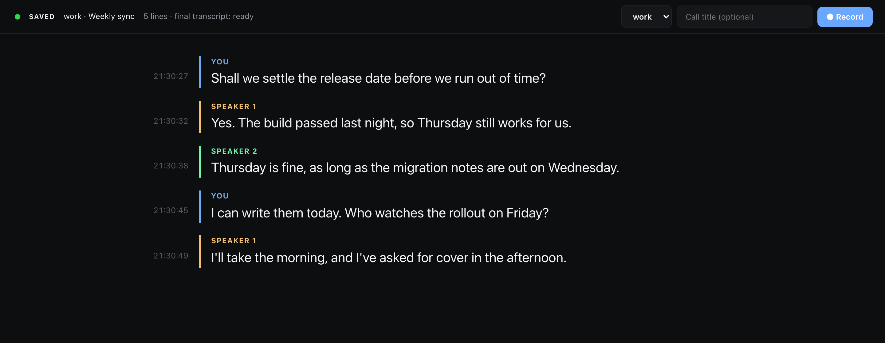

# Usage

hark writes a call's transcript to a file while people are still speaking. hark-viewer shows that file in the browser as it grows, with a colour per speaker and a clock time per line, and puts Record, Stop, Pause and Mute on the same page. It also ships an [agent skill](https://github.com/GeiserX/hark-viewer/blob/main/SKILL.md), so a coding agent such as Claude Code can start a recording and answer questions about the call while it is happening.

## What it does

- Shows each utterance a moment after the speaker pauses, labelled `You` for the microphone and `Speaker 1..N` for voices on the computer side.
- Shows the line still being spoken in grey under the finished ones, when hark reports one. The start request asks for it (`liveStreaming` in `START`), so a hark that can stream does, and one that cannot ignores the key. The first words appear about 2 seconds after they are spoken and the open line grows every 0.6 seconds until it closes. It is never corrected as it grows. With the setting off the page behaves as before.
- Says so when the capture dies. hark can lose the call side and go on reporting `recording`; the page shows a red banner when hark proves it, and an amber note when it can only guess.
- Restarts a broken capture into the same call folder, so one call stays one folder on one clock.
- Files every call in its own folder, keeps the audio, and writes the accurate transcript on its own once the call stops.

## Commands and the page

```sh
git clone https://github.com/GeiserX/hark-viewer.git
cd hark-viewer

./hark-viewer work "Weekly sync"   # record a call filed under "work" and open the page
./hark-viewer open                 # open the page without recording
./hark-viewer stop                 # stop and save the call
./hark-viewer restart              # capture broke mid-call: stop, and record on into the same folder
./hark-viewer quit                 # stop the call, the page server and the hark agent
./hark-viewer relabel              # fix the speaker labels of the call just finished
./hark-viewer finalize             # write the accurate transcript by hand (a stopped call gets it on its own)
./hark-viewer languages            # say which languages a call was in, and write nothing
```

The first recording asks for the Microphone and System Audio Recording permissions. macOS attributes them to the terminal app you ran the command from.

You can also start from the page. Pick a folder, type a title and press **Record**.

Three things can be asked of the page through its URL. `?call=workspace/name` opens that call
instead of the current one, `?workspace=name` puts that folder at the top of the picker even
before any call has been filed under it, and `?quiet=SECONDS` changes how long the page waits
before it guesses that a capture has died.



## Where calls go

```
~/Recordings/calls/<workspace>/<YYYY-MM-DD_HHMMSS>[_title]/
    audio.opus         the recording, microphone left, call right
    transcript.json    one JSON object per line: {"start", "end", "speaker", "text"}
    meta.json          {"started", "workspace", "title", "id"}, plus "parts" once the call was restarted
    transcript.final.json   the accurate transcript, written after the call stops
    transcript.mw.txt       MacWhisper's transcript of the same audio, when MacWhisper is installed
    postprocess.json        how far those two have got, and which languages the call was in
~/Recordings/calls/current  ->  the call being recorded, or the last one
```

`transcript.json` is JSON Lines. hark appends a complete line per utterance, so any program can read the file during the call. `start` and `end` are seconds into the recording; add `start` to `started` in `meta.json` to get the clock time.

The audio is Opus because an Opus file stays playable while hark is still writing it, so a crash mid-call costs nothing. `.m4a` and `.flac` hold back their header until hark stops, and `.wav` would cost 635 MB an hour against Opus's 23. macOS types the file as `org.xiph.ogg-audio`, so transcription apps open it like any other recording.
